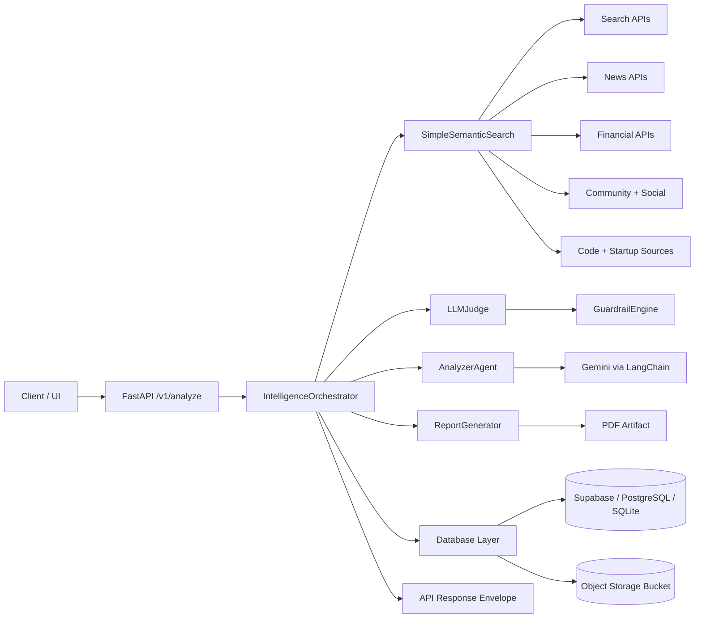
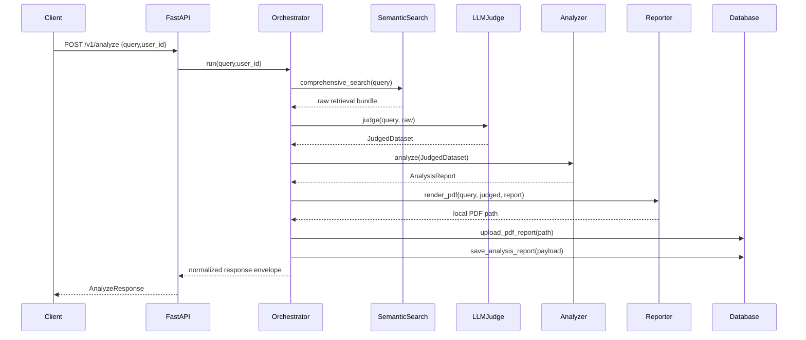

# Market Aggregator - End-to-End Market Intelligence Pipeline

This repository provides a production-oriented market intelligence system that runs an end-to-end flow:

1. Multi-source retrieval (`SimpleSemanticSearch`)
2. Guardrail sanitization and filtering (`GuardrailEngine`)
3. LLM-as-Judge evidence selection (`LLMJudge`)
4. Strategic analysis generation (`AnalyzerAgent`)
5. PDF report generation with citations (`ReportGenerator`)
6. Storage of results, PDFs, and response envelopes (`Database`)

The API entry point is `POST /v1/analyze` in `app/main.py`.

## Table of Contents

1. Overview
2. Architecture
3. Methodology
4. Project Structure
5. Runtime Flow
6. Setup and Installation
7. Configuration
8. Running the System
9. API Contract
10. Output Artifacts
11. Reliability and Guardrails
12. Troubleshooting
13. Documentation Map

## Overview

The system is designed for product, strategy, and market-intelligence workflows where a single query needs to be converted into:

- A validated evidence set from heterogeneous external sources
- A structured, decision-oriented analysis object
- A human-readable PDF report with in-text citations and a bibliography
- Persisted records in DB/storage for historical retrieval

The architecture intentionally separates retrieval, judging, analysis, and reporting so each stage can be independently improved without breaking the full pipeline.

## Architecture

### High-Level Component Diagram



### Sequence Diagram



## Methodology

The methodology is evidence-first and staged:

1. Query planning:
- Classify query intent (`company_analysis`, `funding_intelligence`, etc.)
- Extract entities and keywords
- Select source families based on query type
- Generate bounded search terms to reduce provider throttling risk

2. Heterogeneous retrieval:
- Run async tasks across multiple providers
- Normalize payloads into a common shape
- Capture success/failure metadata for each source

3. Guardrail enforcement:
- Sanitize HTML/markup/noise
- Redact sensitive token-like patterns
- Block prompt-injection-like text
- Apply quality threshold and deduplicate

4. Judge-stage reduction:
- Heuristic scoring for relevance and source quality
- Diversity balancing across sources
- Optional LLM keep/drop refinement
- Produce `JudgedDataset` for analysis

5. Strategic analysis:
- Build structured context (source, theme, timeline breakdowns)
- Ask LLM for strict JSON output with section schema
- Parse/repair malformed JSON when needed
- Fallback synthesis if LLM output is unusable

6. Report rendering:
- Convert analysis object to sectioned PDF
- Add inline numeric citations (`[1][2]` style)
- Add full bibliography table with clickable URLs
- Normalize text to safe glyphs to avoid black-box artifacts

7. Persistence and serving:
- Upload PDF to storage bucket
- Save response envelope to `analysis_reports`
- Return stable API response to caller

## Project Structure

Key paths:

- `app/main.py`: FastAPI endpoint entrypoint (`/v1/analyze`)
- `app/orchestrator.py`: end-to-end orchestration
- `app/simple_semantic_search.py`: retrieval planning + async execution
- `app/pipeline/guardrails.py`: sanitization, redaction, dedupe
- `app/pipeline/llm_judge.py`: evidence selection
- `app/pipeline/analyzer.py`: structured analysis generation
- `app/pipeline/reporting.py`: PDF rendering + citations + bibliography
- `app/pipeline/types.py`: core dataclasses
- `app/db.py`: dynamic DB backend + report persistence
- `config.yaml`: API keys, source lists, DB settings
- `docs/`: detailed module guides

## Runtime Flow

The API runtime flow in `app/orchestrator.py`:

1. `raw = await search_engine.comprehensive_search(query)`
2. `judged = await judge.judge(query, raw)`
3. `analyzed = await analyzer.analyze(judged)`
4. `pdf_local = reporter.render_pdf(query, judged, analyzed)`
5. `pdf_url = await db.upload_pdf_report(pdf_local, bucket="reports")`
6. `report_id = await db.save_analysis_report(...)`
7. Return response envelope with `analysis_mode` and optional `fallback_reason`

## Setup and Installation

### 1. Prerequisites

- Python 3.10+
- Network access for external APIs
- Optional: Supabase/PostgreSQL (SQLite fallback exists)

### 2. Install Dependencies

```bash
pip install -r requirements.txt
```

### 3. Configure Environment and Keys

- Update `config.yaml` with valid provider keys
- Optionally export:

```bash
export GOOGLE_API_KEY="<your-gemini-key>"
```

### 4. Validate Configuration

- Ensure at least one search/news provider key is valid
- Verify DB settings under `database` in `config.yaml`

## Configuration

### Database Block

`app/db.py` supports fallback order:

1. Supabase
2. PostgreSQL (`asyncpg`)
3. SQLite (`data/market_intelligence.db`)

### Fetch Controls

From `config.yaml`:

- `fetch.concurrency`
- `fetch.rate_limit_per_sec`

### Source Lists

Configured source groups include:

- RSS feeds
- GitHub orgs
- Subreddits
- Mastodon instances

## Running the System

### Run API Server

```bash
uvicorn app.main:app --host 0.0.0.0 --port 8000 --reload
```

### Run Semantic CLI

```bash
python semantic_cli.py
```

### Run One-Off Agent Script

```bash
python run_agent.py scan
```

## API Contract

### Request

`POST /v1/analyze`

```json
{
	"query": "Anthropic AI chip market analysis 2025",
	"user_id": "optional-user-id"
}
```

### Response Envelope

```json
{
	"query": "...",
	"status": "success",
	"response": {
		"status": "success",
		"query": "...",
		"pdf_link": "...",
		"report": {
			"summary": "...",
			"key_findings": [],
			"risks": [],
			"recommendations": [],
			"confidence_score": 0.0,
			"sections": {}
		},
		"analysis_mode": "llm|fallback",
		"fallback_reason": null,
		"sources_count": 0,
		"documents_count": 0,
		"report_id": "..."
	},
	"pdf_url": "...",
	"report_id": "...",
	"timestamp": "..."
}
```

## Output Artifacts

Artifacts produced per run:

- JSON search dump in `search_results/`
- PDF report in `search_results/` (then uploaded to storage)
- DB record in `analysis_reports`

PDF characteristics:

- Sectioned report layout
- Inline citations in `[n]` form
- Bibliography with source/title/url
- Clickable URL links

## Reliability and Guardrails

### Current Reliability Controls

- Source-task isolation via safe task builders
- `asyncio.gather(..., return_exceptions=True)` in retrieval
- Guardrail quality filtering and dedupe
- Analyzer JSON extraction + repair + compact retry
- Fallback analysis generation when model output is invalid
- DB backend failover strategy

### Known Operational Realities

- Third-party APIs can return `401`, `403`, `404`, `429`
- LLM output may occasionally require repair or fallback
- Evidence quality depends on external source health and query quality

## Troubleshooting

1. Empty or weak reports:
- Check provider key validity in `config.yaml`
- Confirm `summary.total_documents` in retrieval output
- Inspect guardrail flags for high drop counts

2. Frequent analyzer fallback:
- Check `response.fallback_reason`
- Reduce prompt scope or query breadth
- Validate Gemini API availability

3. PDF glyph artifacts:
- Confirm latest `app/pipeline/reporting.py` is deployed
- Re-run report generation after restart

4. Persistence failures:
- Verify Supabase/Postgres credentials
- Check `analysis_reports` schema compatibility

## Documentation Map

- `docs/SEMANTIC_SEARCH_MODULE.md`
- `docs/GUARDRAIL_AND_LLM_JUDGE.md`
- `docs/ANALYSIS_MODULE.md`
- `docs/REPORT_GENERATION_MODULE.md`

These documents provide implementation-level details for each major stage.
