# Market Scout Agent - By Team Phoenix


**Market Scout Agent**  is a Agentic full-stack, safety-first market intelligence platform that converts a single natural-language business query into structured strategic output.

The current production path in code is:
- request intake (`FastAPI`)
- prompt safety validation (multi-layered)
- multi-source retrieval (async, heterogeneous)
- guardrail enforcement + relevance judgment
- strategic report synthesis
- PDF generation with citations
- database and storage persistence

Primary API entrypoint: `POST /v1/analyze` in `app/main.py`.

## Table of Contents
1. Scope and Objectives
2. Architecture Views
3. System Methodology (Deep Dive)
4. Component-by-Component Implementation
5. Data Contracts and Schemas
6. Operational Flows
7. Prompt Safety Engineering
8. Retrieval and Source Strategy
9. LLM Judge Strategy and Scoring
10. Analysis Generation Strategy
11. Report Generation Strategy
12. Persistence and Storage Strategy
13. Frontend and API Integration
14. Runtime Configuration and Environment Strategy
15. Build, Run, and Validation Commands
16. Deployment Architecture
17. Security Model and Hardening Checklist
18. Reliability and Failure Modes
19. Performance Engineering Notes
20. Testing Strategy and Coverage
21. Extension Patterns
22. Documentation Map

## Scope and Objectives

### Primary objectives
- Provide evidence-backed market intelligence for product, strategy, and GTM teams.
- Maintain strict boundary safety for user prompts.
- Remain resilient when some external sources fail.
- Keep architecture modular so stages can evolve independently.

### Non-goals (current implementation)
- Not a real-time streaming analytics system.
- Not a guaranteed-fresh financial terminal.
- Not a full SOC/security observability product.

## Architecture Views

### 1. Context architecture (system boundary)
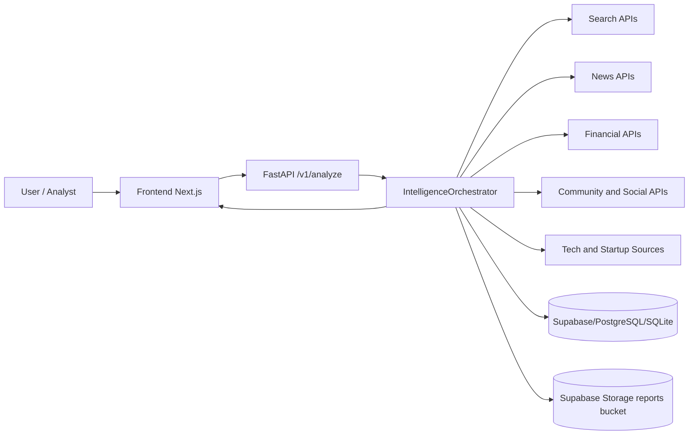

### 2. Container architecture
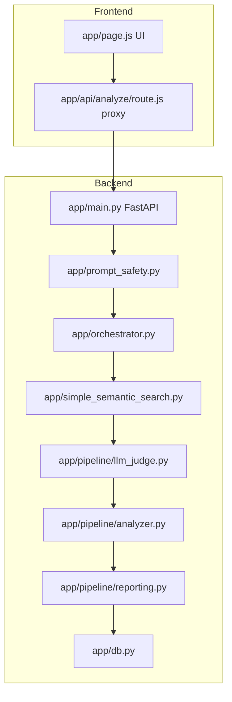

### 3. Component architecture (backend internals)
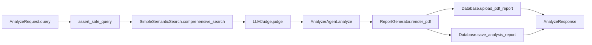

### 4. Sequence architecture (request lifecycle)
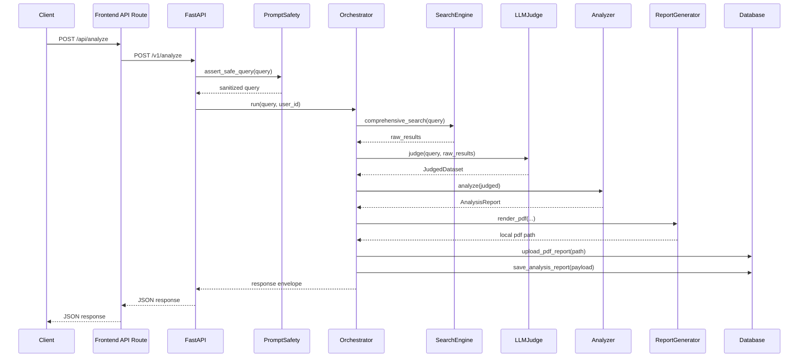

### 5. Deployment architecture (current + target)
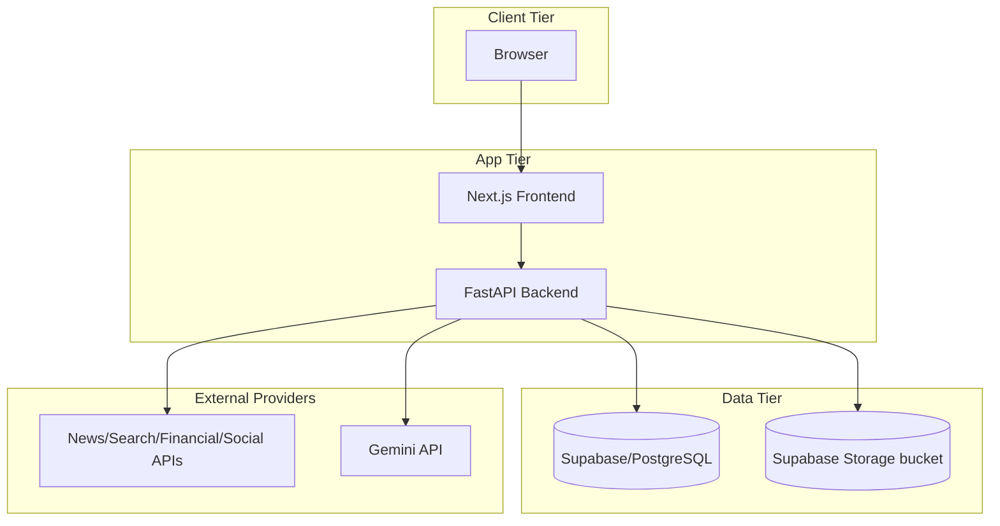

### 6. Dataflow architecture
```mermaid
flowchart LR
  Q[Raw Query] --> Q1[Safety Validate and Sanitize]
  Q1 --> Q2[SearchPlan Build]
  Q2 --> Q3[Async Retrieval]
  Q3 --> Q4[Normalization]
  Q4 --> Q5[Guardrails and Dedupe]
  Q5 --> Q6[Relevance Judge]
  Q6 --> Q7[Strategic Analysis JSON]
  Q7 --> Q8[PDF Render]
  Q8 --> Q9[Storage + DB Persist]
  Q9 --> Q10[Final API Response]
```

### 7. Use Case Architecture
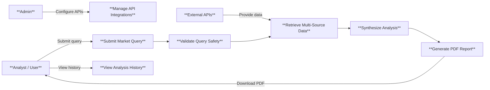

### 8. Logical Architecture (Component Relationships)
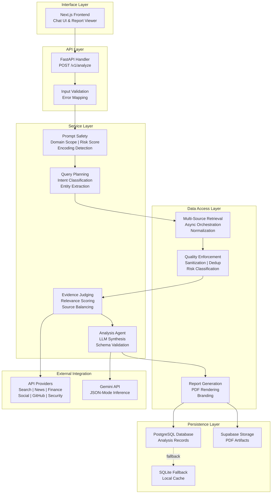

### 9. Implementation View (Module Structure)
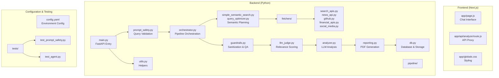

### 10. Process View (Runtime Execution Timeline)
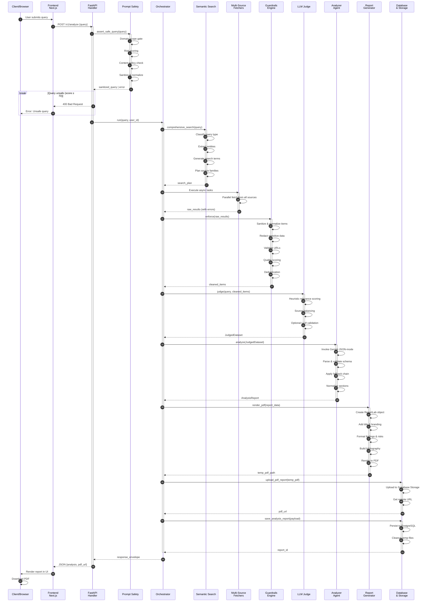

## System Methodology (Deep Dive)

### Stage 0: boundary policy and trust model
- All user input is untrusted.
- External source payloads are semi-trusted and must be sanitized.
- LLM output is treated as potentially malformed and must be parsed/repaired/validated.
- Persistence calls are best-effort and should not break primary response path.

### Stage 1: query safety methodology
Implemented in `app/prompt_safety.py`.

Algorithmic flow:
1. Pre-checks:
- not empty
- max length <= 4000
2. Scope gate:
- allow only market-intelligence intent+context patterns
- block meta-AI/system-probing style prompts
3. Risk evaluation:
- weighted score from content policy + injection + obfuscation + guardrails baseline
4. Thresholds:
- score >= 70 => block
- 45 <= score < 70 => optional semantic LLM adjudication
5. Deterministic checks:
- content policy patterns
- injection/recon patterns
- secret-like token patterns
6. Sanitization:
- `GuardrailEngine.sanitize` before orchestration

Key design choice:
- Domain allowlisting is used to constrain problem space and block indirect reconnaissance that bypasses naive regex-only systems.

### Stage 2: query planning methodology
Implemented in `app/simple_semantic_search.py` + `app/query_optimizer.py`.

Planner outputs a `SearchPlan` with:
- `query_type` enum
- entities
- keywords
- source families
- search terms
- financial symbols

Routing strategy:
- classify query intent
- map intent to source families
- generate bounded search terms to avoid source overload
- derive likely stock symbols for financial enrichment

### Stage 3: retrieval execution methodology

Task generation is source-family based:
- `_create_search_tasks`
- `_create_news_tasks`
- `_create_github_tasks`
- `_create_financial_tasks`
- `_create_business_intelligence_tasks`
- `_create_social_media_tasks`
- `_create_community_tasks`
- `_create_startup_tasks`
- `_create_security_tasks`

Execution model:
- create coroutines per task
- run with `asyncio.gather(..., return_exceptions=True)`
- preserve metadata (`type`, `source`, `query`)
- continue even when subset fails

Normalization model:
- each raw item goes through `normalize_item(source, item)`
- transformed into a canonical shape used downstream

### Stage 4: guardrail and quality methodology
Implemented in `app/pipeline/guardrails.py`.

Each retrieved item is processed as:
1. sanitize title/content
2. redact sensitive strings
3. validate URL
4. compute quality score
5. classify risk flags
6. drop policy-violating or low-quality records
7. deduplicate via deterministic fingerprint

Output:
- cleaned list
- dropped item count
- high-level guardrail flags

### Stage 5: evidence judging methodology
Implemented in `app/pipeline/llm_judge.py`.

Heuristic scoring factors include:
- query term overlap
- title hit bonus
- source-type/source-name weighting
- recency bonus
- content/quality signal from guardrail metadata

Diversity strategy:
- source-balanced selection to avoid overfitting to one provider
- caps to control volume and source skew

Optional LLM judge pass:
- asks Gemini for strict JSON keep/drop index output
- fallback behavior keeps heuristic-selected items when LLM path fails

### Stage 6: analysis synthesis methodology
Implemented in `app/pipeline/analyzer.py`.

Model strategy:
- uses Gemini `gemini-2.5-flash` when key is present
- strict JSON expected
- explicit section schema requested

Robustness strategy:
- parse raw content via multiple parsers
- extract balanced JSON candidates
- attempt repair pass if malformed
- compact prompt retry when truncated or too verbose
- deterministic fallback report when model path fails

Output contract:
- `AnalysisReport` with summary/findings/risks/recommendations/confidence/sections

### Stage 7: reporting methodology
Implemented in `app/pipeline/reporting.py`.

Rendering strategy:
- generate branded PDF with section templates
- include evidence table
- include bibliography with links
- infer section-source citations
- harden text with unicode and xml-safe normalization

### Stage 8: persistence methodology
Implemented in `app/db.py`.

Backend initialization order:
1. Supabase via asyncpg direct
2. Supabase via REST client (where relevant)
3. PostgreSQL via asyncpg
4. SQLite fallback

Persistence operations:
- upload PDF to storage bucket (`reports`)
- save final analysis payload to `analysis_reports`
- keep pipeline alive even if persistence partially fails

## Component-by-Component Implementation

### API gateway (`app/main.py`)
- Validates request via `AnalyzeRequest`
- Runs safety boundary check
- Calls orchestrator
- Normalizes response shape to `AnalyzeResponse`
- Maps exceptions to HTTP 400/500

### Orchestrator (`app/orchestrator.py`)
Main method: `run(query, user_id)`.

Sequential responsibilities:
1. retrieve
2. judge
3. analyze
4. render PDF
5. upload PDF
6. save report
7. return envelope

### Search engine (`app/simple_semantic_search.py`)
- loads config
- initializes sentence transformer
- validates APIs
- builds query plan
- creates and executes async tasks
- normalizes task results
- packages final retrieval response

### Prompt safety (`app/prompt_safety.py`)
- normalization and deobfuscation helpers
- encoded token decoding candidates
- multi-family pattern matching
- risk scoring
- optional semantic adjudication
- output guardrail support

### Pipeline modules (`app/pipeline/*`)
- `guardrails.py`: sanitize/redact/filter/dedupe
- `llm_judge.py`: relevance and diversity selection
- `analyzer.py`: strategic synthesis with robust fallbacks
- `reporting.py`: PDF rendering and bibliography
- `types.py`: structured contracts between stages

### Database abstraction (`app/db.py`)
- dynamic backend selection
- document persistence
- report persistence
- storage upload helper

## Data Contracts and Schemas

### API request schema (`app/schemas.py`)
```json
{
  "query": "string",
  "user_id": "string|null"
}
```

### API response schema (`app/schemas.py`)
```json
{
  "query": "string",
  "status": "string",
  "response": "object",
  "pdf_url": "string|null",
  "report_id": "string|number|null",
  "timestamp": "string"
}
```

### Analyzer logical schema
- summary
- key_findings[]
- risks[]
- recommendations[]
- confidence_score
- sections{...}

Sections include:
- executive_overview
- business_context
- market_landscape
- customer_and_user_signals[]
- competitive_landscape[]
- product_implications[]
- feature_recommendations[]
- go_to_market_implications[]
- strategic_implications[]
- opportunities[]
- risks_and_constraints[]
- decision_ready_next_steps[]
- evidence_highlights[]
- source_breakdown{}
- theme_breakdown{}
- timeline_breakdown{}
- guardrail_summary{}

## Operational Flows

### API flow
1. `Frontend/app/api/analyze/route.js` sends request to backend.
2. backend validates safety.
3. orchestrator executes full pipeline.
4. backend returns normalized JSON.

### CLI flow
Main scripts:
- `semantic_cli.py`
- `run_semantic.sh`
- `simple_search.py`
- `json_query.py`
- `quick_test.py`

Use cases:
- quick testing
- ad-hoc market queries
- API validation
- interactive exploration

## Prompt Safety Engineering

### Defensive layers implemented
1. syntactic checks
2. normalized and decoded candidate scanning
3. injection and recon detection
4. content policy enforcement
5. baseline guardrail checks
6. suspicious secret token checks
7. domain gating
8. risk thresholding
9. optional semantic adjudication

### Risk-scoring strategy
Risk score accumulates from:
- out-of-scope reason
- content-policy hit
- injection hit
- encoded payload candidate count
- baseline guardrail pattern
- suspicious token indicators
- abnormal length

Thresholds:
- block >= 70
- LLM review >= 45

### Safety architecture diagram
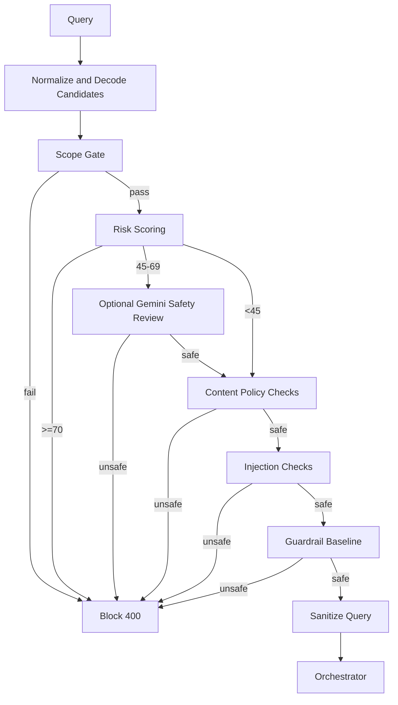

## Retrieval and Source Strategy

### Source family coverage
- Search: serpapi and optional search APIs
- News: newsapi, gnews, currents, guardian/nytimes adapters
- Financial: alpha_vantage, massive, yahoo helpers
- Community: reddit, hackernews, stackoverflow, mastodon
- Social: twitter/x, linkedin
- Tech/product: github and package ecosystem helpers
- Business/startup/security: apollo, startup trackers, shodan, etc.

### Query-type to source-family routing
- `COMPANY_ANALYSIS`: adds financial, github, business, startup, social
- `FUNDING_INTELLIGENCE`: similar broad business+financial profile
- `MARKET_TREND`: adds financial, social, startup
- `COMPETITOR_ANALYSIS`: adds business, financial, social, startup, security
- `PRODUCT_RESEARCH`: emphasizes github + community + social

## LLM Judge Strategy and Scoring

### Why judge stage exists
Raw retrieval is noisy and source-biased. Judge stage compresses evidence into a high-signal, diverse dataset for analysis.

### Judge process
1. flatten raw payload
2. enforce guardrails
3. compute heuristic score
4. apply weak relevance cutoff
5. diversify by source
6. optional LLM keep list
7. return `JudgedDataset`

### Scoring intuition
- lexical overlap improves precision
- stronger source weights improve trust
- recency boosts topical relevance
- diversity limits monoculture bias

## Analysis Generation Strategy

### Analyzer strategy stack
1. infer query lens (competitive, funding, product, market)
2. build context bundle (sources, themes, timeline, evidence samples)
3. invoke LLM with strict JSON mode
4. parse and normalize sections
5. quality gate and retry if sparse
6. repair malformed outputs when needed
7. fallback deterministic report if all else fails

### Why this design is robust
- handles non-JSON model output safely
- maintains response contract under LLM failures
- keeps service live with actionable fallback content

## Report Generation Strategy

### PDF structure
- cover header and query metadata
- executive summary panel
- key findings, risks, recommendations
- deep section pages
- evidence highlights table
- bibliography with links

### Citation method
- builds source/url index from judged items
- maps section to source-priority hints
- renders section citation tokens (e.g., `[1][5]`)

## Persistence and Storage Strategy

### Database strategy
- support supabase/postgres/sqlite with fallback sequence
- lazy table creation for resilience
- non-fatal persistence errors in report save path

### Storage strategy
- upload generated pdf to storage bucket
- return URL when available
- keep local fallback behavior if storage path unavailable

## Frontend and API Integration

### Frontend architecture
Files:
- `Frontend/app/page.js`
- `Frontend/app/api/analyze/route.js`

Behavior:
- chat-like interaction model
- local history persistence
- stage simulation for progress UX
- renders report sections
- downloads pdf when url is available

Proxy behavior:
- forwards to `BACKEND_ANALYZE_URL`
- returns mock payload when backend unavailable for UI development continuity

## Runtime Configuration and Environment Strategy

### Config sources
- `config.yaml`: fetch settings, source lists, db settings, key map
- environment variables: LLM keys and runtime toggles

### Important env vars
- `GOOGLE_API_KEY`
- `GEMINI_API_KEY`
- `PROMPT_SAFETY_LLM_CHECK`
- `BACKEND_ANALYZE_URL`

### Security warning
If any secret exists in tracked files, rotate and move to secret manager immediately.

## Build, Run, and Validation Commands

### Backend
```bash
pip install -r requirements.txt
uvicorn app.main:app --host 0.0.0.0 --port 8000 --reload
```

### Frontend
```bash
cd Frontend
npm install
npm run dev
```

### CLI workflows
```bash
python semantic_cli.py --interactive
python simple_search.py "NVIDIA AI strategy"
python json_query.py "AI chip funding trends"
bash run_semantic.sh search "OpenAI enterprise product strategy"
```

### Safety regression tests
```bash
python -m unittest tests.test_prompt_safety
```

### Additional test scripts
- `tests/test_semantic_search.py`
- `tests/test_optimizer.py`
- `tests/test_agent.py`
- `tests/comprehensive_test.py`
- `tests/run_query.py`

## Deployment Architecture

### Current repository deployment artifacts
- `Dockerfile` builds backend container (`python:3.11-slim`)
- `docker-compose.yml` currently empty
- `wrangler.toml` for Cloudflare Workers deployment
- Configuration loader supports environment variables for serverless

### Supported Deployment Targets
1. **Local Development** - Uses `config.yaml`
2. **Docker/Render** - Environment variables + config
3. **Cloudflare Workers** - Environment variables/secrets (NEW!)
4. **AWS/GCP/Azure** - Container deployment
5. **GitHub Actions/CI-CD** - Environment variable configuration

### Cloudflare Workers Deployment
The application now supports deployment to Cloudflare Workers! 

**Quick Start:**
```bash
# 1. Prepare secrets
cp .secrets.example.json .secrets.json
# Edit with your API keys

# 2. Upload to Cloudflare
./scripts/upload-secrets.sh production

# 3. Deploy
wrangler deploy --env production
```

For detailed instructions, see: **[DEPLOY_TO_CLOUDFLARE.md](DEPLOY_TO_CLOUDFLARE.md)**

### Suggested production topology
1. Frontend service (Next.js)
2. Backend service (FastAPI + orchestrator) OR Cloudflare Workers edge
3. Managed database and object storage (Supabase)
4. Secret manager for API keys (Cloudflare Secrets or vault)
5. Observability stack (logs + metrics + alerts)

### Release strategy
- deploy backend first with compatibility checks
- canary API traffic to validate source health and latency
- deploy frontend after backend envelope compatibility is verified

## Security Model and Hardening Checklist

### Existing controls
- boundary prompt safety checks
- content sanitization and secret redaction
- domain allowlisting
- output leakage pattern checks

### Production checklist
1. secret vaulting + key rotation
2. authenticated API access and user-level authz
3. rate limiting and abuse controls
4. request size and timeout policies
5. strict CORS and network egress controls
6. source allowlist and URL validation hardening
7. security event logging for blocked prompts

## Reliability and Failure Modes

### Failure mode handling already present
- source task failures isolated by `return_exceptions=True`
- LLM failures degrade to deterministic fallback analysis
- persistence failures return generated ids and continue
- missing Gemini key triggers heuristic/fallback modes

### Primary residual failure risks
- external API outages reduce source diversity
- malformed or noisy source data can lower report quality
- latency spikes due to external provider variability

## Performance Engineering Notes

### Current performance levers
- fetch concurrency in `config.yaml`
- limited search term fan-out
- source caps and judge-stage item caps
- temp directory report generation

### Practical optimization options
1. cache frequent source responses by query hash and TTL
2. adaptive source fan-out based on query complexity
3. separate retrieval and analysis into async jobs for long-running queries
4. pre-warm embeddings/model clients on startup

## Testing Strategy and Coverage

### Safety testing
- `tests/test_prompt_safety.py` provides broad attack-category coverage including indirect and encoded attacks.

### Functional and utility tests
- query optimizer behavior tests
- semantic search scripts for end-to-end smoke checks
- business intelligence adapter debug scripts

### Recommended CI test matrix
1. unit tests (safety, optimizer, normalizer)
2. integration tests with mocked external APIs
3. contract tests for response envelope stability
4. regression tests on known dangerous prompt suites

## Extension Patterns

### Add a new data source
1. implement fetcher in `app/fetchers/`
2. create task-builder route in `app/simple_semantic_search.py`
3. add normalization mapping in `app/normalizer.py`
4. add tests for source adapter and normalization behavior

### Add a new analysis output format
1. reuse `AnalysisReport` as canonical internal contract
2. implement renderer (markdown/html/slides)
3. add output selector in orchestrator response assembly

### Add stricter policy modes
1. policy profile config (`strict`, `balanced`, `research`)
2. map profile to risk thresholds and scope rules
3. expose selected profile in response metadata


## TEAM

| Name | GitHub | Role | Responsibilities |
|------|--------|------|------------------|
| Nagaraj Neelam | [@neelamnagarajgithub](https://github.com/neelamnagarajgithub) | Team Leader, Backend Developer & GenAI | Architecture, backend pipeline orchestration, LLM integration, safety engineering |
| Shatakshi Palli | [@ShatakshiPalli](https://github.com/ShatakshiPalli) | Team Member, GenAI Engineer & Frontend Developer | Frontend development, GenAI prompt engineering, UI/UX implementation |
| Srivathsav Thaneeru | [@srivathsavsree](https://github.com/srivathsavsree) | Team Member, Data Engineer | Data retrieval, source integration, data normalization, pipeline optimization |


## Documentation Map

Detailed module docs:
- `docs/DETAILED_ARCHITECTURE.md`
- `docs/SEMANTIC_SEARCH_MODULE.md`
- `docs/GUARDRAIL_AND_LLM_JUDGE.md`
- `docs/ANALYSIS_MODULE.md`
- `docs/REPORT_GENERATION_MODULE.md`
- `docs/PROMPT_SAFETY_MODULE.md`
- `docs/OPTIMIZER_INTEGRATION.md`
- `docs/API_INTEGRATION_STATUS.md`

This README is the consolidated architecture and methodology reference intended for engineering, security, and platform teams.
