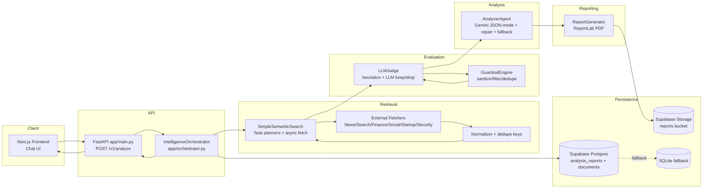
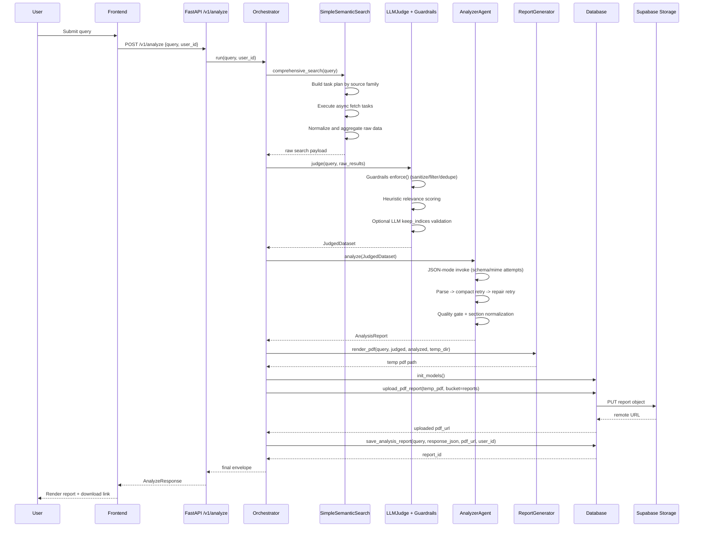

# MarketScout Detailed Architecture

## 1. System Boundary

MarketScout is an API-first market-intelligence system with a chat frontend.
The runtime path for analysis is:

1. Frontend sends query to `POST /v1/analyze`.
2. Orchestrator runs `retrieve -> judge -> analyze -> report -> store`.
3. PDF is generated in a temporary directory, uploaded to Supabase Storage, and local temp files are removed.
4. Final response envelope is returned with analysis payload and remote `pdf_url`.

## 2. Component Architecture

## 3. Runtime Sequence (Detailed)

## 4. Data Contracts

### 4.1 Request Contract

- Endpoint: `POST /v1/analyze`
- Input (`AnalyzeRequest`):
  - `query: string`
  - `user_id: string | null`

### 4.2 Response Envelope

- Top-level:
  - `query`
  - `status`
  - `response` (normalized payload)
  - `pdf_url`
  - `report_id`
  - `timestamp`

- Nested analysis payload includes:
  - `summary`
  - `key_findings[]`
  - `risks[]`
  - `recommendations[]`
  - `confidence_score`
  - `sections{...}`
  - `analysis_mode` (`llm` or `fallback`)
  - `fallback_reason` (when applicable)

## 5. Reliability and Fallback Design

### 5.1 Retrieval/Judge Resilience

- Task builders safely skip unavailable integrations.
- Guardrails sanitize and remove low-signal or unsafe items.
- Judge combines heuristics with optional LLM validation.

### 5.2 Analyzer Resilience

- Primary generation uses JSON-constrained mode where supported.
- Parsing pipeline handles code fences, escaped JSON, malformed JSON repairs, and object extraction.
- Retry chain:
  1. full prompt parse
  2. compact prompt parse
  3. JSON repair call
  4. deterministic fallback report

### 5.3 Storage Resilience

- DB init order: Supabase -> PostgreSQL -> SQLite fallback.
- Report PDF is uploaded remotely; runtime local retention is disabled.

## 6. Persistence Model

### 6.1 `documents`

- Ingested and normalized evidence records with source/provider/content/metadata.

### 6.2 `analysis_reports`

- Query-centric report records with full response JSON and optional `pdf_url`.

## 7. Security and Guardrails

- Prompt injection and suspicious pattern detection in guardrails.
- Sensitive string redaction in text/metadata.
- URL sanity checks and content-quality thresholds.
- Report-facing guardrail summary keeps only high-level operational signals.

## 8. Operational Observability

- Logging at fetch, judge, analyzer, DB, and upload stages.
- Analyzer failures are encoded into `fallback_reason` and guardrail notes.
- Response always returns schema-normalized envelope from API layer.
